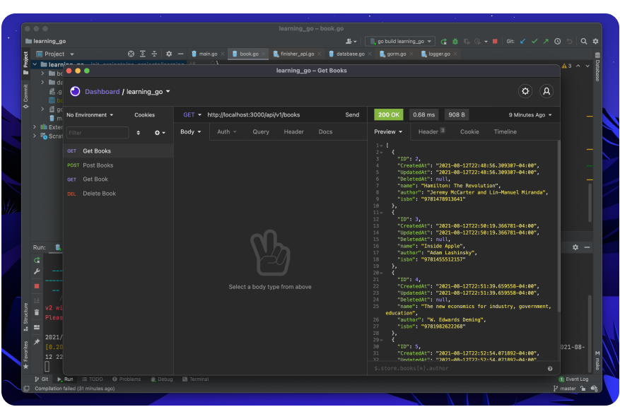

# Learning Go 😄
This repo contains code written as part of a learning exercise for [Go](https://golang.org/). 

The project focuses on a small book API written using [Fiber](https://github.com/gofiber/fiber) and [Gorm](https://gorm.io/). End points allow users to perform basic CRUD operations backed by a SQLite database. 

## Project Structure 📕
The API is broken up into three distinct parts:
1. `main.go` - Main package which kicks of the application. Routes and database setup are performed here. 
2. database - Contains functions and variables for interacting with the SQLite database via Gorm. 
3. book - Struct and handlers for reacting to incoming HTTP request.

## Running locally 👾
To run this project locally, you must have Go `1.16.3` installed on your machine. Installation instructions can be found [here](https://golang.org/doc/install).

1. Clone the repo:
```shell 
git clone https://github.com/Nash0x7E2/learning-go.git
```

2. Open `learning-go` in your favourite text editor or terminal:
```shell
cd learning-go
```

3. Run main.go:
```shell
go run main.go
```

4. Have fun 🎉